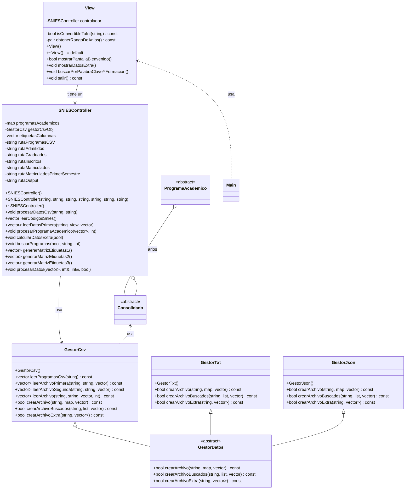

## SNIES Extractor
Gracias al grupo que me presetó el código fuente de este proyecto

## Presentación general
En este proyecto se utilizarán 5 clases para cumplir el propósito de extraer la información del Sistema Nacional de Información de Educación Superior. Para el usuario, este tendrá una interfaz por terminal que le indicará los pasos a seguir y la información que necesita digitar.

## Cumplimiento de Requerimientos

1. **Solicitar rango de años a analizar**  
   En el menú, se le pregunta al usuario cuál es el primer año de búsqueda, tomando en cuenta que los rangos de años siempre son consecutivos, el segundo año de búsqueda se calcula a partir del primero.

2. **Lectura de archivos .csv correspondientes**  
   A partir de los años ingresados por el usuario, el controlador (clase `SNIESController`) leerá la información de los archivos apropiados uno por uno.

3. **Calcular admitidos, inscritos, graduados, matriculados y matriculados de primer semestre por programa y por año**  
   El SNIES-Extractor, mediante su controlador, calculará estos datos por cada programa y año a partir de los datos en bruto que extrae de los archivos .csv apropiados.

4. **Generación de Archivos de Salida**  
   Al terminar de extraer la información y procesarla, el SNIES-Extractor generará un archivo de resultados en la siguiente carpeta que ya debería estar parametrizada en el disco duro:  
   `C:\SNIES_EXTRACTOR\outputs\resultados.csv`.

5. **Visualización de Datos**  
   El SNIES-Extractor muestra al usuario el consolidado de estudiantes por año en programas presenciales o virtuales, la diferencia porcentual anual entre la cantidad de nuevos matriculados durante los años de búsqueda por programa y la lista de programas sin nuevos matriculados en 3 semestres consecutivos. Además, permitirá al usuario exportar esta información en un archivo ubicado en la carpeta ya parametrizada:  
   `C:\SNIES_EXTRACTOR\outputs\extras.csv`.

6. **Filtrado de Programas**  
   Se le pregunta al usuario si desea hacer una búsqueda con 2 filtros entre los programas solicitados: una palabra clave para buscar según los nombres de programas y el nivel de formación de los programas.

7. **Validación de Datos**  
   El SNIES-Extractor es un programa de C++ robusto que puede detectar errores a la hora de recibir información fuera de rangos esperados, tanto de parte del usuario como de la lectura de los archivos .csv.

Más abajo podrán encontrar el diagrama UML de las clases.

## Refactorización y correcciones realizadas 

1.Creación de la clase GestorDatos:
Se implementó una nueva clase base llamada GestorDatos. Esta clase actúa como padre de GestorCsv, GestorJson, y GestorTxt, proporcionando una estructura común para la gestión de archivos.

2. Refactorización del diagrama de clases:
Se realizaron modificaciones en el diagrama UML, agregando las clases GestorJson y GestorDatos. La clase GestorDatos fue definida como la clase padre para las demás clases gestoras de archivos.

3. Implementación de la clase GestorJson:
Se creó una nueva clase encargada de la exportación de datos en formato .json, implementando funcionalidades específicas para manejar este tipo de archivos.

4. Implementación de la clase GestorTxt:
Se añadió una nueva clase para exportar datos en formato .txt, asegurando una estructura consistente con las otras clases gestoras.

5. Refactorización del método de exportación de archivos:
Aunque no existe un método específico llamado exportarDatos, se realizaron ajustes en los métodos encargados de la exportación de archivos (como crearArchivo, crearArchivoBuscados y crearArchivoExtra), corrigiendo encabezados y mejorando la gestión de errores conforme a las recomendaciones de SonarLint.

6. Modificación de los prototipos de clases:
Se realizaron modificaciones en los atributos y métodos de las clases Consolidado, ProgramaAcademico, GestorCSV, y SNIESController para mejorar la cohesión interna, reducir la complejidad y eliminar dependencias innecesarias.

7. Refactorización de las clases Consolidado y ProgramaAcademico:
Se aplicaron principios de diseño GRASP para mejorar la estructura de las clases Consolidado y ProgramaAcademico, facilitando su mantenimiento y evolución.

8. Creación de la clase Settings:
Se añadió una nueva clase Settings, que permite la configuración flexible de parámetros por parte del usuario, centralizando las opciones del proyecto.

9. Implementación de métodos auxiliares en las clases ProgramaAcademico y Consolidado:
Se añadieron métodos auxiliares a estas clases para apoyar en la implementación de diversas operaciones, facilitando la integración con otras clases.

10. Corrección de errores en GestorCSV:
Se solucionaron varios problemas en la clase GestorCSV, incluyendo la inclusión de using namespace std; para resolver conflictos de espacio de nombres.

# Diagrama Mermaid

*El vector de Consolidados tendrá siempre 8 posiciones [0-7] donde:*
*vector[0] es primer año, primer semestre, hombres*
*vector[1] es primer año, segundo semestre, hombres*
*vector[2] es primer año, primer semestre, mujeres*
*vector[3] es primer año, segundo semestre, mujeres*
*vector[4] es segundo año, primer semestre, hombres*
*vector[5] es segundo año, segundo semestre, hombres*
*vector[6] es segundo año, primer semestre, mujeres*
*vector[7] es segundo año, segundo semestre, mujeres*

###Diagrama actualizado

