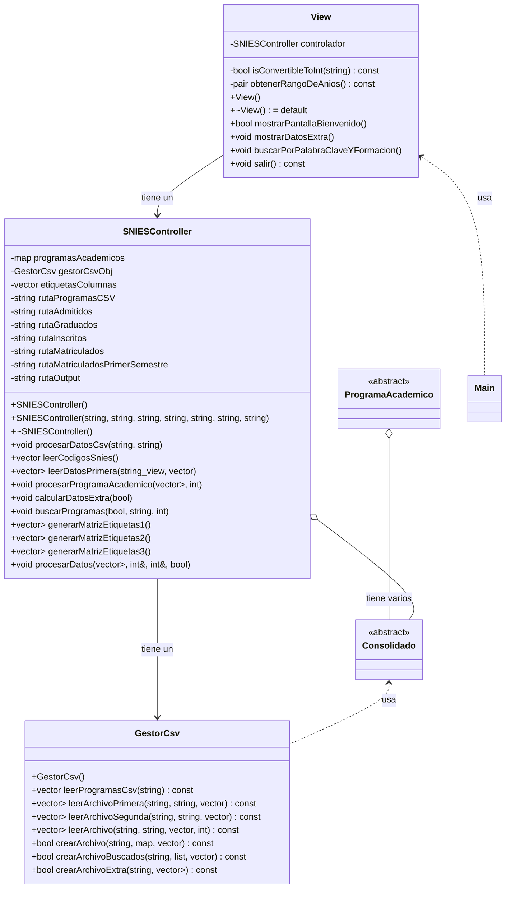

## SNIES Extractor
Gracias al grupo que me presetó el código fuente de este proyecto

## Presentación general
En este proyecto se utilizarán 5 clases para cumplir el propósito de extraer la información del Sistema Nacional de Información de Educación Superior. Para el usuario, este tendrá una interfaz por terminal que le indicará los pasos a seguir y la información que necesita digitar.

## Cumplimiento de Requerimientos

1. **Solicitar rango de años a analizar**  
   En el menú, se le pregunta al usuario cuál es el primer año de búsqueda, tomando en cuenta que los rangos de años siempre son consecutivos, el segundo año de búsqueda se calcula a partir del primero.

2. **Lectura de archivos .csv correspondientes**  
   A partir de los años ingresados por el usuario, el controlador (clase `SNIESController`) leerá la información de los archivos apropiados uno por uno.

3. **Calcular admitidos, inscritos, graduados, matriculados y matriculados de primer semestre por programa y por año**  
   El SNIES-Extractor, mediante su controlador, calculará estos datos por cada programa y año a partir de los datos en bruto que extrae de los archivos .csv apropiados.

4. **Generación de Archivos de Salida**  
   Al terminar de extraer la información y procesarla, el SNIES-Extractor generará un archivo de resultados en la siguiente carpeta que ya debería estar parametrizada en el disco duro:  
   `C:\SNIES_EXTRACTOR\outputs\resultados.csv`.

5. **Visualización de Datos**  
   El SNIES-Extractor muestra al usuario el consolidado de estudiantes por año en programas presenciales o virtuales, la diferencia porcentual anual entre la cantidad de nuevos matriculados durante los años de búsqueda por programa y la lista de programas sin nuevos matriculados en 3 semestres consecutivos. Además, permitirá al usuario exportar esta información en un archivo ubicado en la carpeta ya parametrizada:  
   `C:\SNIES_EXTRACTOR\outputs\extras.csv`.

6. **Filtrado de Programas**  
   Se le pregunta al usuario si desea hacer una búsqueda con 2 filtros entre los programas solicitados: una palabra clave para buscar según los nombres de programas y el nivel de formación de los programas.

7. **Validación de Datos**  
   El SNIES-Extractor es un programa de C++ robusto que puede detectar errores a la hora de recibir información fuera de rangos esperados, tanto de parte del usuario como de la lectura de los archivos .csv.

Más abajo podrán encontrar el diagrama UML de las clases.

# Diagrama Mermaid

*El vector de Consolidados tendrá siempre 8 posiciones [0-7] donde:*
*vector[0] es primer año, primer semestre, hombres*
*vector[1] es primer año, segundo semestre, hombres*
*vector[2] es primer año, primer semestre, mujeres*
*vector[3] es primer año, segundo semestre, mujeres*
*vector[4] es segundo año, primer semestre, hombres*
*vector[5] es segundo año, segundo semestre, hombres*
*vector[6] es segundo año, primer semestre, mujeres*
*vector[7] es segundo año, segundo semestre, mujeres*

###Diagrama actualizado

